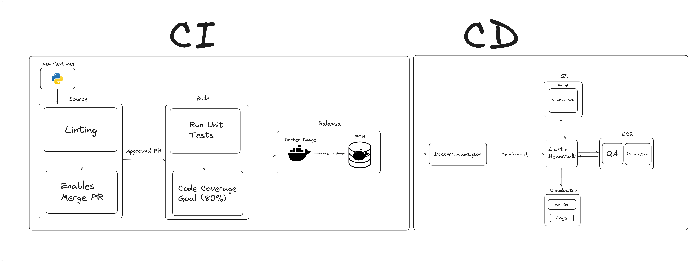
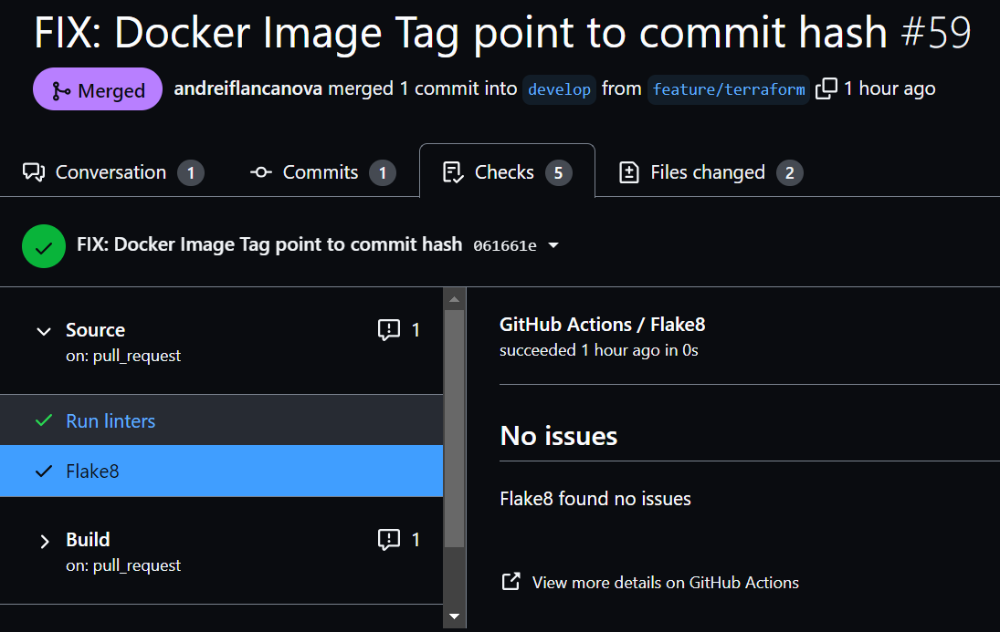
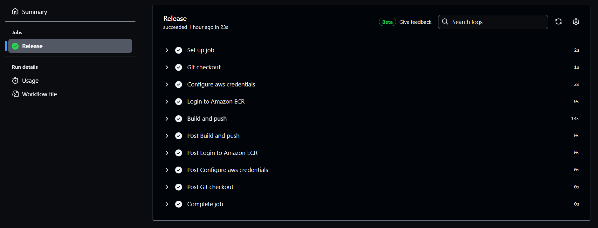

# Hackathon AdaTech - Vem ser Tech (trilha DevOps)

## Case: Aplicação de Zoológico com Inclusão visual

**💪 Desafio:**

Vocês fazem parte de um time de consultoria da corpsolution, que foi alocado em um projeto em um zoológico. Vocês terão acesso a um projeto e o desafio é criar pipelines de CI/CD relacionados ao tema de Diversidade e Inclusão e configurar a infraestrutura necessária para hospedar e escalar a aplicação API em Python. Eles devem garantir a automação dos processos de construção, teste e implantação da aplicação, seguindo as melhores práticas de DevOps.

**📦Entregáveis:**
* Documentação detalhada dos pipelines e infraestrutura criados, incluindo instruções de configuração e operação.

* Apresentação final do projeto, demonstrando os pipelines e infraestrutura implementados e explicando as decisões tomadas durante o processo de desenvolvimento.

## Resolução do Time DO-1: IntegraZoo

Essa aplicação tem como objetivo, criar uma infraestrutura para uma API de Zoológico, utilizando funções que faça a inclusão de pessoas com deficiencia visual, com o objetivo de aumentar a diversidade e inclusão desse grupo na empresa Corp Solutions.

Para criar uma inclusão dentro do código, pensamos em definir documentações iniciais em todos os arquivos necessários para a configuração de CI/CD da aplicação. Um fato importante é que pessoas com deficiência visual utilizam programadas que fazem a leitura de arquivos, utilizando ferramentas como o <a href="https://www.nvaccess.org/">NVDA</a>, incluindo arquivos de ambiente de programação. E muitas vezes, para o entendimento daquele arquivo é necessário que eles tenham que passar linha a linha para ver as configurações que estão sendo aplicadas no arquivo em questão. Então, para resolver esse problema, se tivermos descrições detalhadas das configurações que estão sendo contempladas naquele arquivo, o membro com defiência visual poderia facilmente entender as funcionalidades de todas as partes da aplicação e, consequentemente, ter maior inclusão e produtividade no ambiente de trabalho.

### Colaboradores:

 
<table align="center">
  <tr align="center">
    <td>
      <a href="https://github.com/andreiflancanova">
        
        
Andrei   Lançanova

      </a>
    </td>
    <td>
      <a href="https://github.com/viniciushpiotto">
        
        
Vinícius   Piotto

      </a>
    </td>
        <td>
      <a href="https://github.com/Walttinho">
        
        
Walter   Netto

      </a>
    </td>
    <td>
      <a href="https://github.com/W3l1n6t0n">
        
        
Welington   Júlio

      </a>
    </td>
  </tr>
</table>

### Tecnologias:

### Pipeline - DevOps

## Continuous Integration:

### O que é Integração Contínua (CI)?

De acordo com a própria [AWS](https://aws.amazon.com/pt/devops/continuous-integration/#:~:text=A%20integra%C3%A7%C3%A3o%20cont%C3%ADnua%20%C3%A9%20uma,cria%C3%A7%C3%B5es%20e%20testes%20s%C3%A3o%20executados.), a integração contínua é uma prática de desenvolvimento de software de DevOps em que os desenvolvedores, com frequência, juntam suas alterações de código em um repositório central. 

Depois disso, criações e testes são executados. Geralmente, a integração contínua é a fase de compilação ou integração do processo de lançamento de software e consiste em um componente de automação (por exemplo, um serviço de CI ou compilação) e um componente cultural (por exemplo: aprender a integrar com frequência).

Os principais objetivos da integração contínua são encontrar e investigar erros mais rapidamente, melhorar a qualidade do software e reduzir o tempo necessário para validar e lançar novas atualizações de software.

## Proposta de Pipeline de Integração Contínua (CI) do IntegraZoo

A ideia da equipe do IntegraZoo consistiu em utilizar uma pipeline CI baseada nas seguintes etapas:
- Source
- Build
- Release

### Source
A etapa de Source inicia quando um Pull Request é aberto, onde é executada uma validação para identificar se há algum problema com o código que se intenciona submeter ao repositório. 

#### Linting (Enables Merge PR)

Para isso, considerando que a aplicação em questão é uma app Python, foi utilizado um linter largamente utilizado para esta linguagem que é o [Flake8](https://aws.amazon.com/pt/devops/continuous-integration/#:~:text=A%20integra%C3%A7%C3%A3o%20cont%C3%ADnua%20%C3%A9%20uma,cria%C3%A7%C3%B5es%20e%20testes%20s%C3%A3o%20executados.). A seguir são mostrados dois exemplos, sendo o primeiro de um caso de PR que passou na validação de linting, e o segundo, um caso onde existiam problemas de código.

'")

Estando esta validação ok, é habilitado o recurso de Merge para o Pull Request. A ação de Merge do Pull Request dá início ao processo de Build.

### Build

A etapa de build deste projeto consiste no download dos artefatos que são dependências do projeto, que são baixados conforme a especificação do arquivo [requirements.txt](https://github.com/adahack-2024-devops-team-do-1/adahack-2024-devops-team-do-1/blob/develop/backend/requirements.txt).

#### Run Unit Tests
Após, são executados os testes unitários da aplicação, que intencionam um Code Coverage Report de 80%. Quando a execução dos testes é concluída, o usuário que abriu o Pull Request é notificado

Uma vez estando ok o fluxo de build, isso sensibiliza o processo de release.

### Release

O processo de release consiste em executar o docker build da imagem da aplicação, bem como a sua publicação no Amazon Elastic Container Registry (ECR).

Para que isso seja possível, é necessário criar uma role do IAM que conceda as devidas permissões de acesso para o GitHub Actions. Neste projeto, isso foi feito utilizando um OIDC provider, cujo processo de criação foi realizado via console da AWS, em passo-a-passo devidamente descrito [neste link](https://aws.amazon.com/pt/blogs/security/use-iam-roles-to-connect-github-actions-to-actions-in-aws/). É importante frisar que é necessário conceder as permissões para as ferramentas do ECR, S3 e do IAM, para que esta role possa ser utilizada tanto para a parte de release quanto para a parte de deploy utilizando o Terraform.

Uma vez conferidas as permissões, é utilizada a GitHub Action [Configure AWS Credentials for GitHub Actions](https://github.com/aws-actions/configure-aws-credentials), que recebe a URL ARN da role que foi criada para uso do GitHub Actions, assim com a região da AWS na qual o repositório privado do ECR foi criado, conforme pode ser consultado no arquivo [release.yml](https://github.com/adahack-2024-devops-team-do-1/adahack-2024-devops-team-do-1/blob/develop/.github/workflows/release.yml).

Neste projeto, por questão de facilidade de versionamento, foi utilizado como tag de versionamento de releases o commit hash do Merge do último Pull Request realizado. A figura a seguir ilustra a pipeline executando de forma bem-sucedida o envio da nova imagem para o ECR:

## Continuous Delivery:

Na busca pela otimização da abordagem adequada ao projeto, optamos por implementar o **Elastic Beanstalk**, levando em consideração a simplicidade da estrutura da aplicação, desprovida de um banco de dados ou outras camadas que demandem configurações específicas. A escolha se fundamentou na **facilidade de uso**, na **gestão automática de carga** e no **monitoramento de recursos oferecidos pelo serviço**. Todavia, é importante ressaltar algumas desvantagens inerentes a essa implementação, tais como a **limitação no controle total da infraestrutura** e a necessidade de garantir a reprodutibilidade e consistência ao criar ambientes semelhantes, como os de desenvolvimento e produção.

Para armazenar as imagens dos contêineres, estabelecemos a criação de um repositório no **Elastic Container Registry (ECR)**, visando a velocidade no momento da atualização por estar no mesmo serviço da aplicação.Entretanto, outra abordagem bastante recorrente seria utilizar o serviço do Docker Hub para armazenar as nossas imagens por meio de um repositório privado.

Além disso, utilizamos o **Simple Storage Service (S3)** para guardar o arquivo de configuração **Dockerrun**, compactado em formato zip. Esse arquivo contém o nome do repositório no ECR, juntamente com sua última versão atualizada, permitindo assim a **atualização automática da aplicação** no Elastic Beanstalk sempre que houver uma nova versão na branch de produção.

Por fim, empregamos um arquivo **deploy.yml** que automatiza todas as ações requeridas após o recebimento de um novo push no repositório de infraestrutura. Isso inclui a atualização do arquivo Dockerrun.aws.json, a inicialização do Terraform, a passagem de **variáveis sensíveis** por meio dos GitHub Actions Secrets, a aplicação de todas as atualizações via terraform apply e a finalização das configurações do ambiente do Elastic Beanstalk.

Apesar da estrutura já estabelecida, há aspectos que viso aprimorar progressivamente:

-  Um desses pontos é a adoção do **Kubernetes** para orquestração de contêineres, visando uma **escalabilidade** e *resiliência superiores*, pois a robustez do monitoramento fornecido pelo Kubernetes é crucial nesse contexto. 

- Além disso, pretendo fortalecer as práticas de **segurança**, explorando maneiras de ocultar informações sensíveis que possam representar obstáculos futuros para a aplicação.

- Por fim, a integração de **ferramentas de monitoramento** de logging surge como uma boa escolha para a estratégica de identificar e resolver problemas de forma ágil e concisa.

### Aplicação Final:

Se você desejar acessar a aplicação: http://enviroment-for-production.eba-2wrm9qxj.us-west-2.elasticbeanstalk.com/
